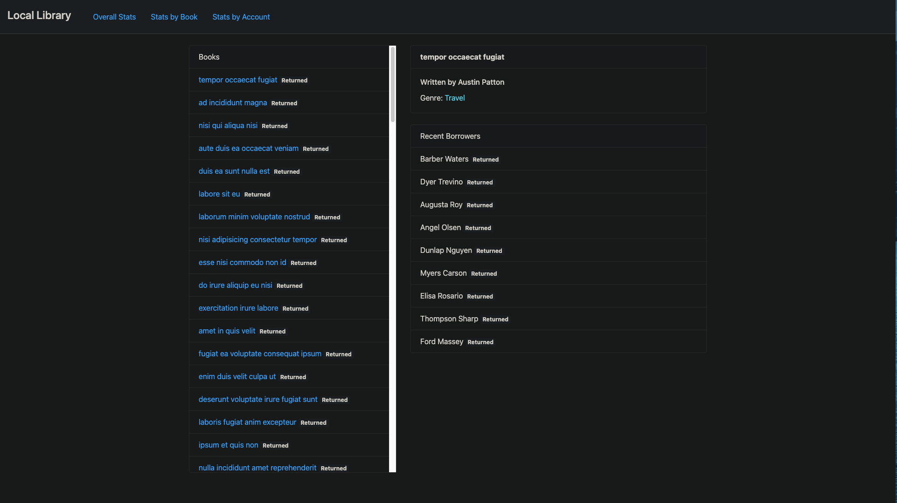
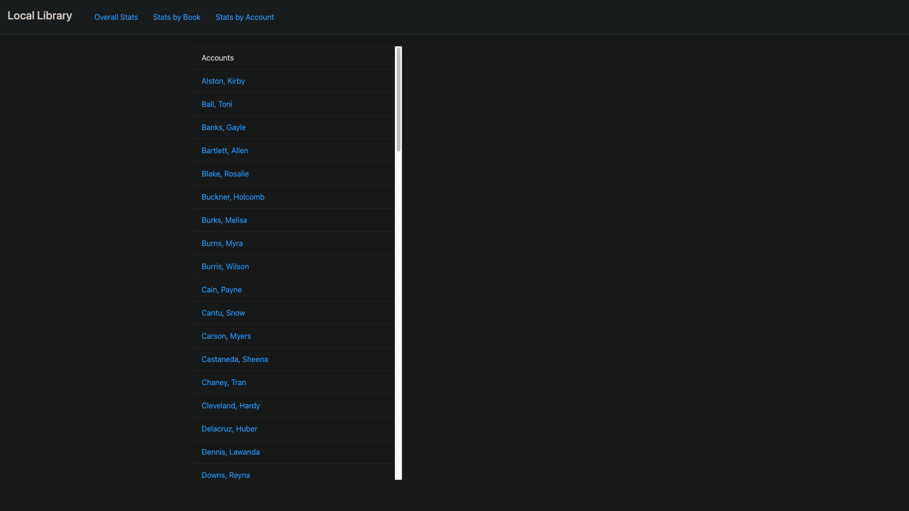

# Local Library

> Link to live app: https://tender-easley-433635.netlify.app/

### Overview

**The Local Library Dashboard** 
The Local Library is designed to keep track data such as the most common genres, the most popular books, and authors. It also keeps track of general stats like the amount of books in-stock, books being borrowed,
and the amount of registered accounts with the library.

### Dashboard

The main url will always redirect to the overall stats of the library where you can easily identify the overall status of the library.

### Stats by Book

This page gives the user an overall look at the status of books along with some general information on the book such as the author and genre. It lets the user see what books have been returned and what books are still being borrowed.

### Stats by Account

This page gives the user an overview of Account stats that display the name and the books that have been borrowed along with the status of the rental. (returned or borrowed).

