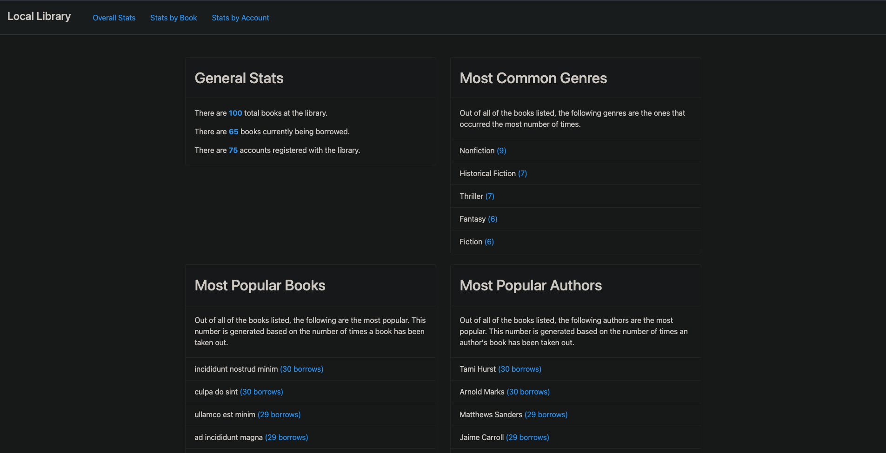

# Local Library

> Link to live app: https://tender-easley-433635.netlify.app/

### Overview

**The Local Library Dashboard** Is designed to keep track of 
### API Docs

### /Dashboard (/)
The main url will always redirect to the dahsboard which will default to displaying the tables and the current date's as reservations. 

### /reservations/new
Clicking new reservation in the menu on the left or top of the screen will navigate you to the new reservation page where you can create a new reservation and post to the dashboard. 

Upon submitting a reservation the dashboard will display the reservations for the date of reservation last created. Reservations have a status that defaults to "booked" which allows the user to edit, seat, or cancel a reservation.

### reservations/:reservation_id/edit
Clicking the 'edit' button on a reservation will navigate to the edit route which will load the reservations information into a reservation form where it can be edited, saved, or cancelled. 

### reservations/:reservation_id/seat
Clicking the seat button on a reservation will navigate to the seat route which will allow the user to select a table from the available tables, and prevents the user from seating a reservation at a table that is too small for the reservations party size. 

Upon submitting, the user will return to the previous page to see the dashboard has been updated, showing the reservation with status "seated" and the selected table with status "occupied". The table will also now have a "Finish" button on it. 

When a reservation has finished, the user can select the "Finish" button on the table to change the status of the table to "free" and the status of the reservation to "finished". Finished reservations are hidden from the dashboard but can be accessed through th search bar. 

### tables/new

Clicking the "New Table" button in the menu will navigate the user to the new table screen where they can create a new table. 

### reservations/search

Clicking the "search" option from the menu will navigate the user to the search screen where they can enter a phone number and search the entire database for that number. 

### Backend main stack
- Express
- Knex 
- postgreSQL
- Node.js
-  Heroku

### Frontend main stack
- React 
- HTML
- CSS
- JS
- Node.js
- Heroku

